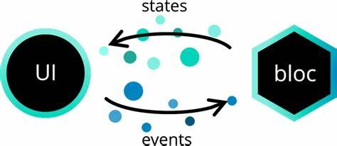

# Study Savvy App
## Introduction
The application has two main function
1. Summarize the content in the class
2. Correct the articles which user written

Furthermore, in the application we can upload the file including audio or graph and gain the content calculated or predicted by AI.

The backend repository is in </br>
https://github.com/weiawesome/study_savvy_api_go </br>
https://github.com/weiawesome/study_savvy_asyncwork_celery/tree/master

## User Interface

## System Architecture

The project we use the BLoC architecture to build the application.

Hence, What is BLoC architecture ?

In order to introduce the BLoC architecture, we can the project architecture at first.
```
# Project Architecture
├── README.md
├── lib
│   ├── blocs
│   │   ├── blocs.dart
│   │
│   ├── models
│   │   ├── models.dart
│   │
│   ├── screens
│   │   ├── screens.dart
│   │
│   ├── services
│   │   ├── API_services.dart
│   │
│   ├── styles
│   │   ├── styles.dart
│   │
│   ├── widgets
│   │   ├── widgets.dart
│   │
│   ├── main.dart
```
### blocs
> In Bloc, like the bridge with UI and service.
> If the UI need the data, publish an event to bloc.
> When the service is complete, it will send the state to UI.
### models
> This is the model for request and response.
### screens
> This is all screens(pages) should be designed here.
### services
> This is where to call the API request.
### styles
> When the UI has some sharing style, it can be written here to avoid repeat too much.
### widgets
> When the widget in UI can be sharing, it can be written here.

### Summarize to BLoC 


Hence, just like the graph showing and project setting.

In this architecture, we can easily separate UI and logic unit. 

